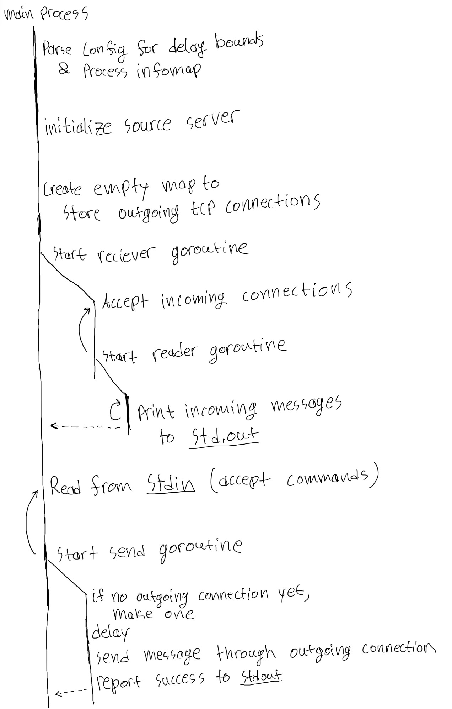

# GOing-around

A simple TCP messenger. 

### Definitions: 
 - instance: an instance refers to a program and all of its running subprocesses that is instantiated after executing the initializing command `./process ...`
 - Subprocess: refers to a goroutine that is spawned and runs throughout the entire runtime of the program. This includes the unicast_reciever, all outgoing connections, as well as the main process.
 - goroutine: when referring to a goroutine as such, it means the purpose of the thread is short lived . (e.g., a send command is processed in its own goroutine to ensure its non-blocking)

### Usage guide
To initialize an instance of the messenger, run `./proccess <id> <OPTIONAL: config path>`
this will start an instance with properties corresponding to the given id in config.
By default, the config path routes to "config" in the working directory.
A message is sent by entering the input `send <id> <message>` into the standard input of a running instance. 
an instance must be running with the id being sent to in the send command for the message to be received.
messages simulate a random latency with bounds outlined on in the first line of config.

### Main Subprocess
The program starts by parsing the config file into a slice with the simulated delay bounds and a proccess_info map indexed by string id.
The main subprocess then initializes a server listener for the source port associated with the id provided in the command arguments, as well as an empty map to track outgoing connections.
Then another subprocess is spawned off main, "unicast-reciever" to handle incoming messages. 
The main subprocess's purpose after completing startup tasks is to listen to stdinput and spawn "unicast_send" goroutines that handle the sending of messages

### unicast_send reference: 
The unicast_send reference is inclusive of all code encapsulated in the goroutine that contains the call to the "unicast_send" function.
It starts by checking the outgoing connection map to see if an outgoing connection was already established. If not, the goroutine establishes an outgoing connection and updates the outgoing connection map. The goroutine then prints that the message was sent, sleeps for a bounded random period of time to mimic network delay, and then calls `unicast_send()`, passing the destination connection of type `net.Listener` and the message to be sent. Here, the sender writes the message through to the destination connection in true TCP fashion using a slice of type `[]byte` and exits if any errors are experienced during the write.

### unicast_recieve reference: 
The unicast receiver requires an initialized `net.Listener` as a parameter which is used to infinitely accept new connections from other processes dialing in by being contained within an infinite for loop. New connections are assigned to variable `conn` and passed to a new nested function, which is run on a new goroutine to allow for infinite concurrency without blocking. Within this new nested function, all successful incoming messages written through `conn` are handled and passed through to `process_received_m()` where the message is parsed and printed. When a connected process disconnects, the receiver responds by closing the connection and notifying the user.

### process_info reference:
    type process_info struct {
        ip   string
        port string
    }

### additional notes on design choices: 
in order for the recieving instance to know which instance sent a message, a header is included in each message with the sender id.

### config file
pattern:  
>[lower delay bound] [upper delay bound]  
>[id] [ip] [port]  
>...  
>[id] [ip] [port]  
  
example:  
>100 500  
>1 127.0.0.1 4069  
>2 127.0.0.1 4070  
>3 127.0.0.1 4071  
>4 127.0.0.1 4072  

### program execution flow

